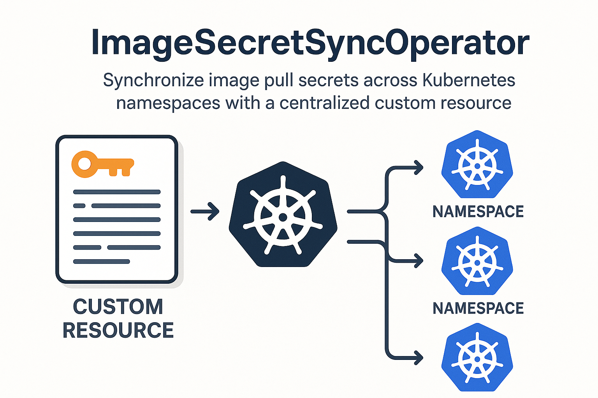

# ImageSecretSyncOperator 🚀

> **Automate** image pull secret management across multiple Kubernetes namespaces with ease.

---

## 🔍 What Problem Are We Solving?

In large Kubernetes clusters, teams often need to pull container images from private registries. Manually creating and updating image pull secrets in each namespace is:

* **Tedious & Error-Prone** ❌
* **Time-Consuming** ⏳
* **Hard to Audit** 🔒

**ImageSecretSyncOperator** streamlines this by providing a central place to define your registry credentials and automatically distributing them to all the namespaces you choose.

---

## 📦 How It Works

1. **Define your credentials** via a `ClustRegCred` Custom Resource.
2. **Spec** your list of target namespaces.
3. **Apply** the CRD and let the operator:

   * Create or update the named image pull secret in each namespace.
   * Keep secrets in sync whenever you update the CR.


*Example: Operator reads `ClustRegCred`, then syncs secrets across namespaces.*

---

## 🛠️ Getting Started

1. **Deploy the Operator**

   ```bash
   kubectl apply -f deploy/operator.yaml
   ```

2. **Create your `ClustRegCred`**

   ```yaml
   apiVersion: imageregistrycredential.pradix.io/v1alpha1
   kind: ClustRegCred
   metadata:
     name: sample-clustregcred
     namespace: default
   spec:
     email: user@example.com
     username: your-docker-username
     password: super-secret-password
     registry: https://index.docker.io/v1/
     secretName: my-image-pull-secret
     namespaces:
       - default
       - team-namespace
   ```

3. **Apply your CR**

   ```bash
   kubectl apply -f clustregcred-sample.yaml
   ```

4. **Verify**

   ```bash
   kubectl get secret my-image-pull-secret -n team-namespace
   ```

---

## 🎨 Features

* **Centralized Control**: One CR to rule them all.
* **Automatic Sync**: Secrets are created/updated as you change your CR.
* **Namespace Whitelist**: Choose exactly where your secrets go.
* **Secure Storage**: Leverages Kubernetes Secrets and RBAC.

---

## 🔄 Updating Credentials

Simply update your `ClustRegCred`:

```bash
kubectl edit clustregcred sample-clustregcred -n default
```

The operator will detect changes and roll out updated secrets to all listed namespaces.

---

## 📄 License

This project is licensed under the Apache 2.0 License. See [LICENSE](LICENSE) for details.

---

*Enjoy automated registry secret management!*
